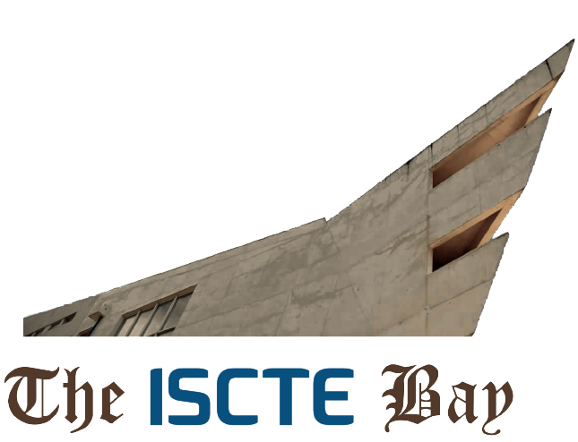

## The ISCTE Bay

  

### [Enunciado do projeto](others/enunciado.pdf)

### Introdução

Neste projeto pretende-se desenvolver um sistema de descarga de ficheiros binários (neste caso imagens) distribuído. Devem existir vários utilizadores na rede P2P e todos podem fazer pedidos de ficheiros aos outros utilizadores ou responder aos pedidos recebidos enviando partes (blocos) dos ficheiros pretendidos. O foco do trabalho é na aplicação de programação concorrente e distribuída, sendo que a parte gráfica das aplicações dos utilizadores deverá ser considerado um aspeto secundário.

**Arquitetura**

Em termos gerais, a solução deve apresentar uma arquitetura P2P (Peer-to-peer) onde as aplicações dos utilizadores trocam mensagens directamente entre si sempre que pretendem saber quem tem determinados ficheiros ou pretende pedir um ficheiro. A solução a implementar não deve recorrer a um servidor central que garante a ligação entre as aplicações dos diferentes utilizadores. Deve no entanto implementar um servidor que faz o papel de directório, onde os utilizadores devem registar a sua entrada ou saída da rede e poder perguntar a qualquer momento quais os outros utilizadores que se encontram na rede.
